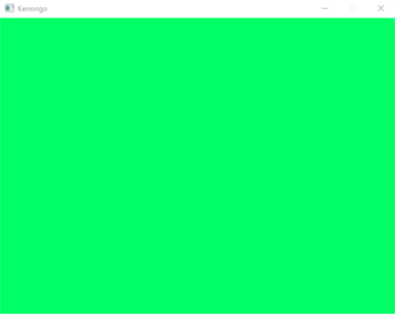

# SDL2 Window

Merupakan source code dari artikel di [medium.com/pemrograman](https://medium.com/pemrograman)

## Harus di Install
- Microsoft C++ Build Tools
- vcpkg (C++ Package Manager)
- sdl2  `(vcpkg install sdl2)`
- cmake

## TOOLCHAIN FILE
Untuk mengetahui TOOLCHAIN_FILE jalankan `vcpkg integrate install`

## Compile
Clone repo ini dan jalankan perintah dibawah ini (Windows 10)

```
mkdir build
cd build
cmake .. "-DCMAKE_TOOLCHAIN_FILE=E:/sdk/vcpkg/scripts/buildsystems/vcpkg.cmake"
cmake --build .
```

> Jika SDL2.dll tidak terkopi secara otomatis ke Debug atau Releseas maka kopi SDL2.dll dari folder vcpkg

```
.\Debug\main.exe
```




